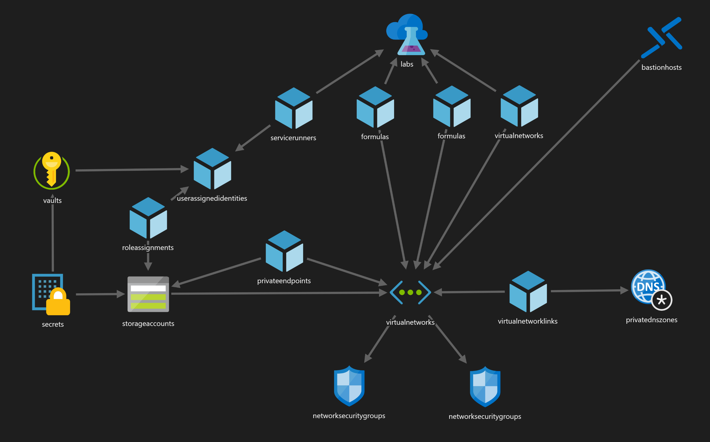

# data-science-sandbox

`data-science-sandbox` defines an Azure-hosted sandbox environment to enable third-parties to collaborate on data science solutions over protected data sets

## Usage

```shell
az group create -n sandbox -l westus2
az group deployment create -g sandbox --template-file azuredeploy.json
```

## Overview



The sandbox is modeled as an Azure DevTestLab that sits inside an isolated VNET. After deploying the lab, admins can customize the environment, while sandbox operators can create new VMs to enable experimentation while keeping data secure.

### Roles

It's likely that a few distinct personas may interact with the sandbox

* Administrator:
  * Deploys the ARM template to create the sandbox
  * Ensures compliance with organizational IT policy
  * Works with the Sandbox Operator to enable allowed resources (Azure resources, web services, etc)
  * Links the sandbox to any outside resources (storage, networking, etc)
  * Grants access to the Sandbox Operator
* Sandbox Operator:
  * Creates sandbox VMs
  * Grants access to Data Scientists
  * Provides resources for the sandbox (blobs, secrets, etc)
* Data Scientist:
  * Perform data science & machine learning tools inside sandbox VMs

### Architecture

There are a number of notable design decisions in the base template. You may choose to enhance or drop any of these, but they provide a safe default environment to start from

* DevTestLabs
  * Limited to defined VM images and sizes
  * Public artifact feeds disabled
  * Predefined Windows & Linux DSVM formulas for instant provisioning
  * VMs are created in a defined resource group & VNET
* Virtual Machines
  * Based on the Data Science Virtual Machine image (Windows 2019 or Ubuntu)
  * Must be accessed via Azure Bastion
  * Auto-shutdown enabled to save on costs
  * Managed Identity enabled to access Azure resources w/o credentials
* Storage
  * Accessible only over private IP space to the created network
  * Always-encrypted via Microsoft-managed keys
  * Secure access (HTTPS) enforced
  * VM Managed Identity is granted read-only access
* Networking
  * Inbound & outbound traffic must be explicitly added to the NSG allow list
  * Services preapproved via NSG Service Tag:
    * AzureActiveDirectory - for AAD logon (Azure Storage Explorer, Visual Studio, Azure CLI)
    * AzureResourceManager - to access ARM & enumerate what resources are available (Storage, Key Vault)
    * AzureKeyVault - to allow secret retrieval
  * Private DNS enables resolution of private Storage endpoints
* Key Vault
  * Provides a secure area to store sandbox-level shared secrets
  * Preloaded with a minimum-scoped read-only SAS URI for applications that don't support Managed Identity

## Development

I recommend using VS Code with the following extensions

* [ARM Template Viewer](https://marketplace.visualstudio.com/items?itemName=bencoleman.armview)
* [Azure Resource Manager (ARM) Tools](https://marketplace.visualstudio.com/items?itemName=msazurermtools.azurerm-vscode-tools)
* [Rainbow Brackets](https://marketplace.visualstudio.com/items?itemName=2gua.rainbow-brackets)
